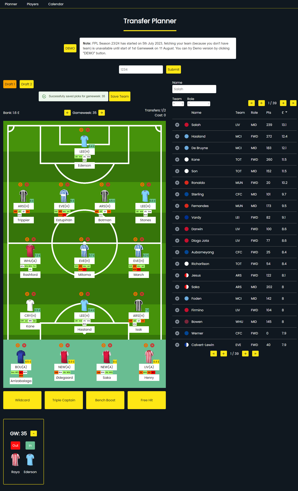
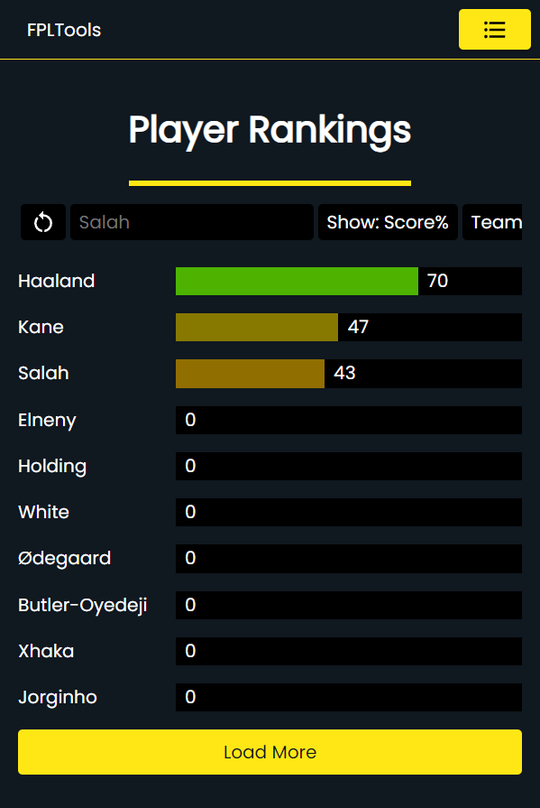
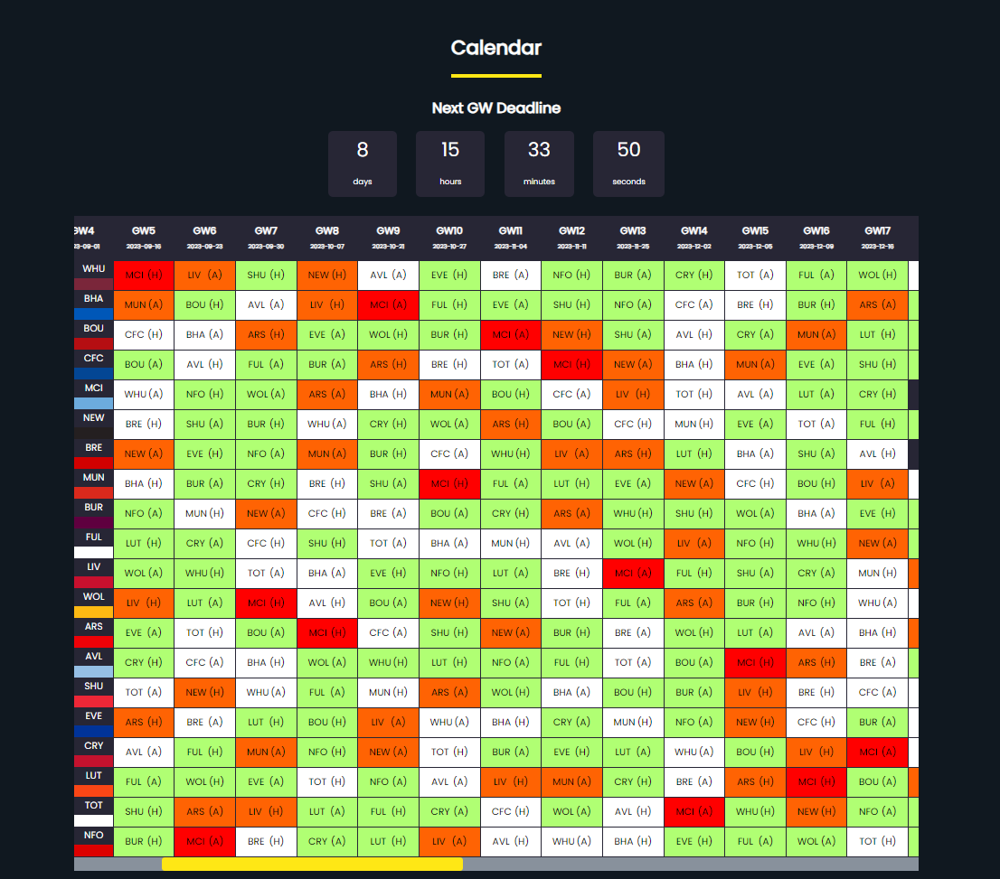

# **FPLTools** - App with tools to improve Fantasy Premier League users gameplay

## Live

[FPLTools](https://fpltools.onrender.com)

## Features

### Done

:white_check_mark: Transfer Planner - The main feature of the app, it enables to manipulate on users exactly like on official FPL app, but the team for every gameweek can be saved and user can make changes to their team for actual and future gameweeks. There are 2 available drafts, user can manipulate on own team by choosing one of the drafts and compare to the other one. List of all players contains all players from FPL game, every element has primary info about player and player from list can be added to the draft. After making transfers, user can view summary of transfers.

:white_check_mark: FDR Schedule - Fixture Difficulty Ranking for all the fixtures throughout whole season

### In Progress

:large_orange_diamond: Predict player chances to score or keep a clean sheet - Chances to score or keep a clean sheet shown in percentages 

### Plans

:white_circle: CMS
:white_circle: Blog

## About

Project is created in **MERN** stack (React + TS). Data fetched from backend is provided by [FPL API](https://fantasy.premierleague.com/api/bootstrap-static/), data related to all users is stored in database. For data related to specific user backend server acts like proxy server.

Link to backend project: [FPLTools backend](https://github.com/FPLTomeczek/BackendFPLToolsV2)

## Screenshots

### Transfer Planner

 

### Player Rankings

 

### Calendar

 
